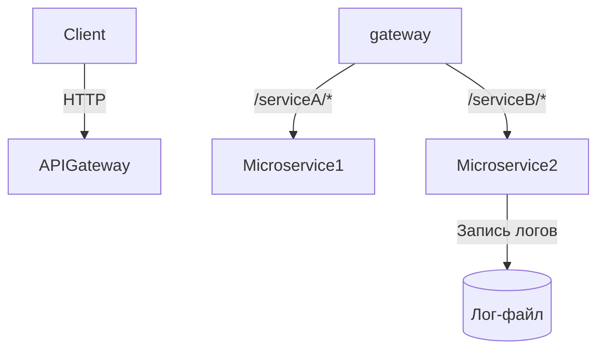

# Микросервисная архитектура с API Gateway


## 📋 Содержание
- [Обзор](#-обзор)
- [🏗 Архитектура](#-архитектура)
- [⚙️ Сервисы](#️-сервисы)
    - [Микросервис 1](#микросервис-1)
    - [Микросервис 2](#микросервис-2)
    - [API Gateway](#api-gateway)
- [🛠 Технологии](#-технологии)
- [🚀 Начало работы](#-начало-работы)
    - [Требования](#требования)
    - [Установка](#установка)
    - [Запуск](#запуск)
- [📡 API Endpoints](#-api-endpoints)
- [📊 Мониторинг](#-мониторинг)

## 🌐 Обзор

Проект представляет собой микросервисную архитектуру с двумя независимыми сервисами, координируемыми через API Gateway.

**Ключевые особенности:**
- ✅ Маршрутизация запросов через API Gateway
- ✅ Асинхронная обработка сообщений с Spring Integration
- ✅ Централизованная конфигурация
- ✅ Health-check мониторинг
- ✅ Файловый логгинг запросов

## 🏗 Архитектура


Архитектура:

```mermaid
┌───────────────────────┐    ┌───────────────────────┐
│       Клиент          │    │                       │
└──────────┬────────────┘    │  ┌─────────────────┐  │
│                            │  │   Микросервис 1 │  │
│     HTTP-запросы           │  │  (App-1:8083)   │  │
┌──────────▼────────────┐    │  └─────────────────┘  │
│                       │    │                       │
│        gateway        ├────►                       │
│    (Cloud:8084)       │    │  ┌─────────────────┐  │
│                       │    │  │   Микросервис 2 │  │
└───────────────────────┘    │  │  (App-2:8082)   │  │
│  └────────┬────────┘  │    │  └─────────────────┘  │
│           │           │    └───────────────────────┘
│  ┌────────▼────────┐  │
│  │   Лог-файл      │  │
│  │ (requests.log)  │  │
│  └─────────────────┘  │
└───────────────────────┘
```

## ⚙️ Сервисы

### Микросервис 1
- **Порт:** 8083
- **Основной endpoint:** `/serviceA/hello`
- **Ответ:** Приветствую! Вы в приложении: App-1

### Микросервис 2
- **Порт:** 8082
- **Основной endpoint:** `/serviceB/hello`
- **Ответ:** Приветствую! Вы в приложении: App-2

### Логгирование
- Запись в файл `user_requests.log`

### API Gateway
- **Порт:** 8084
- **Маршрутизация:**
    - `/serviceA/**` → `http://localhost:8083`
    - `/serviceB/**` → `http://localhost:8082`

---

## 🛠 Технологии
- **Язык:** Java 17
- **Фреймворки:**
    - Spring Boot 3.x
    - Spring Cloud Gateway
    - Spring Integration
- **Тестирование:**
    - JUnit 5
    - Playwright

---

## 🚀 Начало работы

### Требования
- JDK 17
- Maven 3.9+
- Доступ к портам 8082, 8083, 8084.

## Установка
```bash
git clone [имя-репозитория]
cd microservice1 && mvn clean install
cd ../microservice2 && mvn clean install
cd ../gateway && mvn clean install
```

## Запуск
### Terminal 1:
`cd microservice1 && mvn spring-boot:run`

### Terminal 2:
`cd microservice2 && mvn spring-boot:run`

### Terminal 3:
`cd gateway && mvn spring-boot:run`

### Или через интерфейс idea
Откройте IDEA с папкой `gateway` и запустите проект `CloudApplication` <-- `Run`

Откройте папку `microservice1` и запустите проект `Microservice1Application` <-- `Run`

Откройте папку `microservice2` и запустите проект `Microservice2Application` <-- `Run`


## 📡 API Endpoints

### Микросервис 1
- **Основной endpoint:** `/serviceA/hello`
- **Ответ:** Приветствую! Вы в приложении: App-1

### Микросервис 2
- **Основной endpoint:** `/serviceB/hello`
- **Ответ:** Приветствую! Вы в приложении: App-2

### API Gateway
- **Маршрутизация:**
- `/serviceA/**` → `http://localhost:8083`
- `/serviceB/**` → `http://localhost:8082` 


## 📊 Мониторинг

Запуск мониторинга
```GET /actuator/health```
```GET /actuator/info```