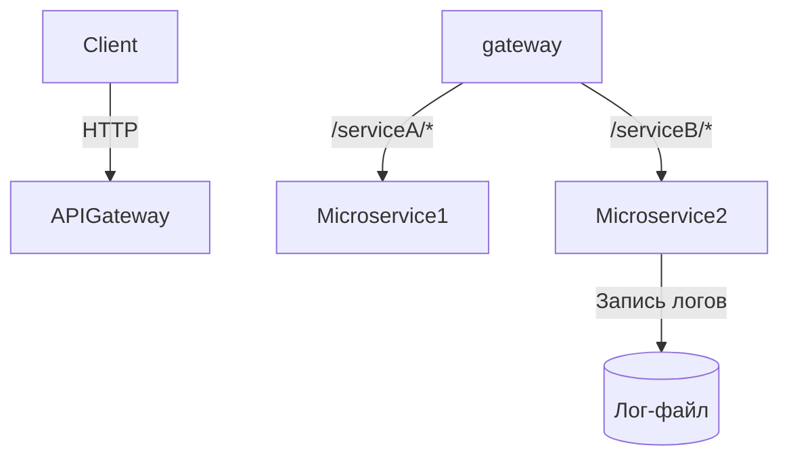
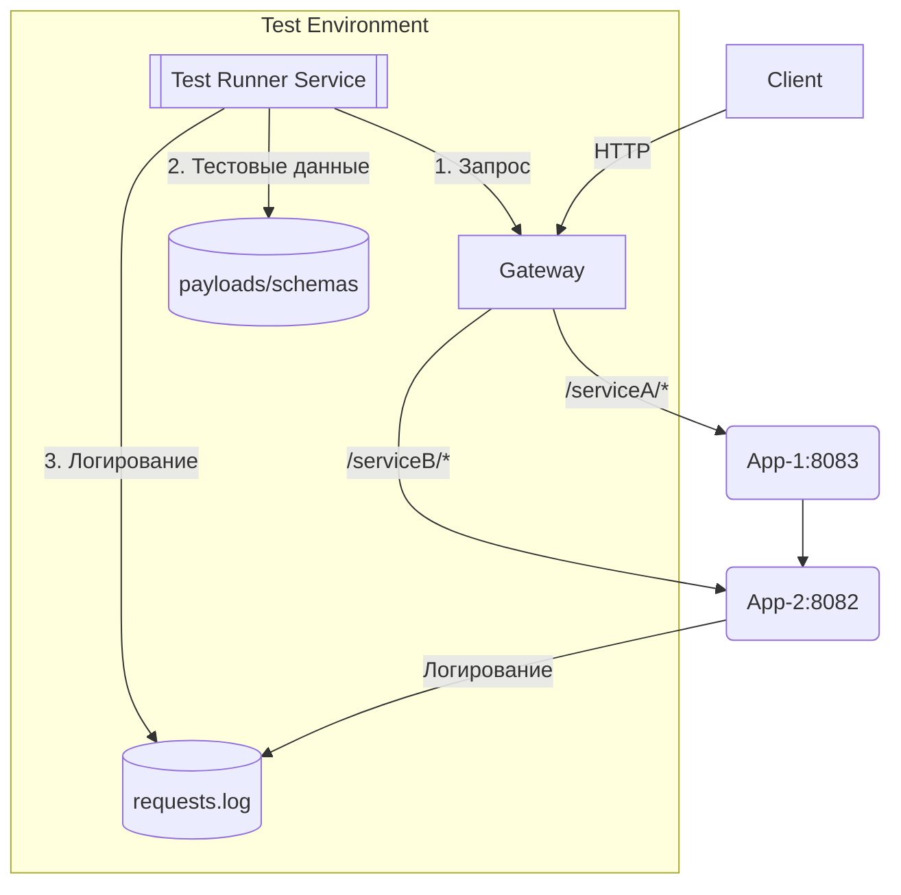

# Микросервисная архитектура с API Gateway


## 📋 Содержание
- [Обзор](#-обзор)
- [🏗 Архитектура](#-архитектура)
- [⚙️ Сервисы](#️-сервисы)
  - [Микросервис 1](#микросервис-1)
  - [Микросервис 2](#микросервис-2)
  - [API Gateway](#api-gateway)
- [🛠 Технологии](#-технологии)
- [🚀 Начало работы](#-начало-работы)
  - [Требования](#требования)
  - [Установка](#установка)
  - [Запуск](#запуск)
- [📡 API Endpoints](#-api-endpoints)
- [🧪 Тестирование](#-тестирование)
- [📊 Мониторинг](#-мониторинг)

## 🌐 Обзор

Проект представляет собой микросервисную архитектуру с двумя независимыми сервисами, координируемыми через API Gateway.

**Ключевые особенности:**
- ✅ Маршрутизация запросов через API Gateway
- ✅ Асинхронная обработка сообщений с Spring Integration
- ✅ Централизованная конфигурация
- ✅ Health-check мониторинг
- ✅ Файловый логгинг запросов

## 🏗 Архитектура


### Архитектура тестирования представлена на рисунке ниже:



```angular2html
┌───────────────────────┐       ┌─────────────────────────────┐
│       Клиент          │       │                             │
└──────────┬────────────┘       │  ┌───────────────────────┐  │
           │                    │  │   Integration Tests   │  │
           │                    │  │ (Test Runner Service) │  │
┌──────────▼────────────┐       │  └───────────┬───────────┘  │
│                       │       │              │              │
│        Gateway        │       │              ├──────────────┼─────┐
│    (Cloud:8084)       ◄───────┘              │              │     │
└──────────┬────────────┘                      └──────────────┘     │
           │                                   ▲                    ▼
┌──────────┴────────────┐            ┌─────────┴─────────┐  ┌──────┴───────┐
│  Микросервис 1        │            │  Тестовые данные  │  │  Лог-файлы   │
│  (App-1:8083)         │            │ (payloads/schemas)│  │(requests.log)│
└──────────┬────────────┘            └───────────────────┘  └──────────────┘
           │
┌──────────┴────────────┐
│  Микросервис 2        │
│  (App-2:8082)         │
└───────────────────────┘
```

## Integration Tests Service:
### Пояснения:

- Отдельный сервис, не участвующий в основном потоке данных

- Имеет доступ ко всем компонентам системы:

- Отправляет запросы через Gateway (как обычный клиент)

- Проверяет лог-файлы

Использует тестовые данные из ресурсов

- Запускает 3 типа тестов:

- api/ - напрямую к микросервисам

- integration/ - через Gateway

- e2e/ - сценарии

#### Направление взаимодействия:

```graph LR
IT[Integration Tests] -->|HTTP-запросы| G(Gateway)
IT -->|Чтение| L[Лог-файлы]
G -->|Роутинг| M1[Микросервис 1]
G -->|Роутинг| M2[Микросервис 2]
M1 -->|Логирование| L
M2 -->|Логирование| L
```
### Особенности реализации:

- Работает на отдельном порту (например, 8085)

- Не влияет на работу основной системы

- Использует общие конфигурации из src/test/resources

- Может запускаться:

- Локально во время разработки

- В CI/CD пайплайне

- Как отдельный Docker-контейнер

#### Поток данных:

- Запуск тестов

- Генерация тестовых запросов

- Отправка через Gateway

- Проверка ответов

- Валидация логов

- Формирование отчетов (Allure)


### Структура приложения тестов:
```angular2html
integration-tests/
└── src/
    └── test/
        ├── java/
        │   └── com/
        │       └── example/
        │           └── tests/
        │               ├── api/              # API-тесты отдельных сервисов
        │               │   ├── ServiceAApiTest.java
        │               │   └── ServiceBApiTest.java
        │               ├── integration/      # Тесты взаимодействия сервисов
        │               │   ├── ServiceAIntegrationTest.java
        │               │   └── ServiceBIntegrationTest.java
        │               ├── e2e/              # Сквозные тесты всего приложения
        │               │   └── FullFlowTest.java
        │               ├── utils/            # Вспомогательные классы
        │               │   ├── TestConfig.java
        │               │   └── ApiClient.java
        │               └── TestRunner.java   # Запускатель тестов (опционально)
        └── resources/
            ├── config/               # Конфигурационные файлы
            │   └── test.properties
            └── data/                 # Тестовые данные
            │   ├── payloads/         # Примеры запросов
            │   │   └── serviceA-request.json
            │   └── schemas/          # JSON-схемы для валидации
            │       └── serviceB-response-schema.json
            │                # Логи запросов 
            └── logback-test.xml
            └── allure-config.yml
```
## 🧪 Тестирование

`mvn clean test`

bash:

`mvn -Dspring.profiles.active=test test`

## ⚙️ Сервисы

### Микросервис 1
- **Порт:** 8083
- **Основной endpoint:** `/serviceA/hello`
- **Ответ:** Приветствую! Вы в приложении: App-1

### Микросервис 2
- **Порт:** 8082
- **Основной endpoint:** `/serviceB/hello`
- **Ответ:** Приветствую! Вы в приложении: App-2

### Логгирование
- Запись в файл `user_requests.log`

### API Gateway
- **Порт:** 8084
- **Маршрутизация:**
  - `/serviceA/**` → `http://localhost:8083`
  - `/serviceB/**` → `http://localhost:8082`

---

## 🛠 Технологии
- **Язык:** Java 17
- **Фреймворки:**
  - Spring Boot 3.x
  - Spring Cloud Gateway
  - Spring Integration
- **Тестирование:**
  - JUnit 5
  - Playwright

---

## 🚀 Начало работы

### Требования
- JDK 17
- Maven 3.9+
- Доступ к портам 8082, 8083, 8084.

## Установка
```bash
git clone [имя-репозитория]
cd microservice1 && mvn clean install
cd ../microservice2 && mvn clean install
cd ../gateway && mvn clean install
```

## Запуск
### Terminal 1:
`cd microservice1 && mvn spring-boot:run`

### Terminal 2:
`cd microservice2 && mvn spring-boot:run`

### Terminal 3:
`cd gateway && mvn spring-boot:run`

### Или через интерфейс idea
Откройте IDEA с папкой `gateway` и запустите проект `CloudApplication` <-- `Run`

Откройте папку `microservice1` и запустите проект `Microservice1Application` <-- `Run`

Откройте папку `microservice2` и запустите проект `Microservice2Application` <-- `Run`


## 📡 API Endpoints

### Микросервис 1
- **Основной endpoint:** `/serviceA/hello`
- **Ответ:** Приветствую! Вы в приложении: App-1

### Микросервис 2
- **Основной endpoint:** `/serviceB/hello`
- **Ответ:** Приветствую! Вы в приложении: App-2

### API Gateway
- **Маршрутизация:**
- `/serviceA/**` → `http://localhost:8083`
- `/serviceB/**` → `http://localhost:8082`


## 📊 Мониторинг

Запуск мониторинга
```GET /actuator/health```
```GET /actuator/info```